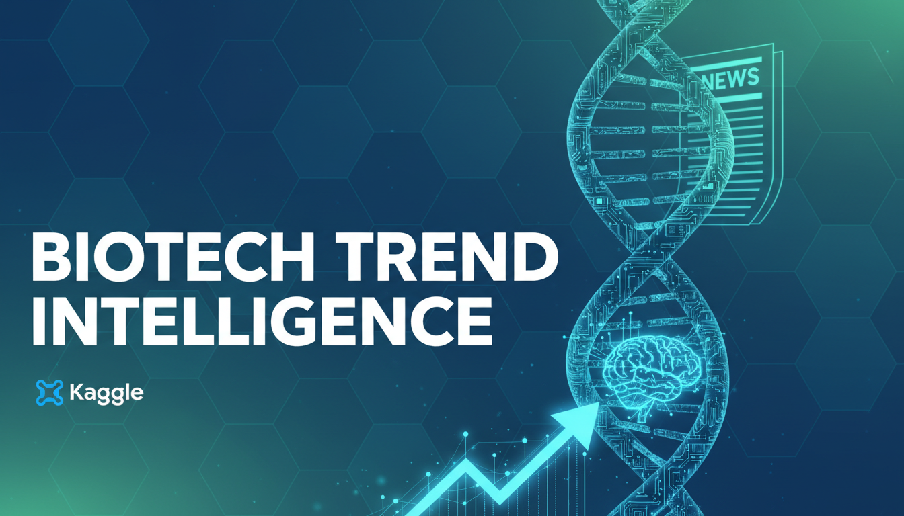

# *An interactive intelligence platform showcasing automated trend extraction across the biotech ecosystem.*

Submitted 12/1/2025 as a *Concierge Agent* for [Google AI Agents Intensive Capstone Project](https://www.kaggle.com/competitions/agents-intensive-capstone-project/overview).

by Jeel Faldu and Paul London

---

## Overview

**Biotech Trend Intelligence** is a data-driven pipeline we built to automatically monitor emerging developments across the biotechnology industry and convert them into structured, decision-ready insights. The project demonstrates our ability to design a clean, reliable workflow that ingests real-world biotech news, processes it through a controlled AI summarization layer, and outputs standardized JSON used by a lightweight [**Streamlit dashboard**](https://biotechtrendintelligence.streamlit.app/).

The system collects articles from curated biotech-focused RSS feeds—including therapeutics, clinical development, genomics, synthetic biology, regulatory updates, and market dynamics—and parses each item into a unified schema.

Rather than using AI for prediction or classification, we intentionally limit the LLM’s role to:

1. **Summarizing article content**
2. **Extracting key scientific and industry terms**
3. **Assigning a trend relevance score** based on novelty, mechanistic significance, and potential impact

This ensures transparency, reproducibility, and alignment with practical use cases where LLMs act as *structured summarizers* rather than autonomous agents.

---

## AI Processing Layer

Each article is passed through a deterministic, schema-oriented prompt returning:

- A concise scientific summary  
- Extracted mechanisms or key terms  
- Optional pipeline stage information  
- A single numerical trend score (1–10)

All outputs are validated for correctness, and malformed generations are automatically retried. This highlights practical **prompt engineering for reliability**, reflecting real-world production constraints.

---

## Data Architecture

All extracted entries are stored as structured JSON—the core dataset powering the project.

Our Streamlit dashboard is intentionally lightweight:

- **No live AI calls**
- **No real-time embedding generation**
- **No clustering or heavy computation on the frontend**

Instead, it loads precomputed JSON and presents the insights in an interactive interface with filters, charts, and expandable detail views. This mirrors how production analytics systems are architected: heavy lifting offline, fast UI online.

---

## Topic Clustering

The project includes a lightweight topic-clustering component built using classical methods:

- Offline embeddings  
- KMeans and cosine similarity for grouping  
- LLM-assisted labeling using a predictable template  

This approach keeps the system interpretable, auditable, and aligned with scientific standards of transparency.

---

## Engineering Highlights

A major engineering focus was on batching logic and rate-limit management:

- Dynamic batch sizing to avoid quota exhaustion  
- Automated retries for transient 429 errors  
- Schema validation ensuring consistent outputs across batches  

These components demonstrate practical ML engineering experience—moving beyond notebooks into **reliable, automated pipelines**.

---

## Skills Demonstrated

The project highlights several strengths relevant to ML engineering, bioinformatics, and data-driven development:

- End-to-end data pipeline design  
- Practical AI integration for structured summarization  
- Robust data engineering execution  
- Unsupervised ML for topic grouping  
- Effective prompt engineering and schema alignment  
- Handling messy real-world RSS data  
- Domain familiarity with biotech: therapeutics, gene editing, oncology, and regulatory science  

---

## Dashboard

The Streamlit front end offers a polished, user-first interface where users can explore:

- Extracted biotech trends  
- Trend scores  
- Key terms  
- Summaries and article sources  
- Interactive Plotly visualizations  

The dashboard remains responsive because all computation is preprocessed and stored as JSON.

---

## Conclusion

**Biotech Trend Intelligence** is a practical demonstration of responsible AI use—not model-heavy experimentation. We use LLMs for focused tasks (summarization, key-term extraction, scoring) while relying on classical data engineering and unsupervised ML to deliver structure and reliability.

The project exemplifies the type of real-world ML engineering work we aim to pursue: building tools that help analysts, researchers, and decision-makers navigate complex scientific landscapes through clean data, clear structure, and thoughtful AI integration.

---

## Contact

For questions or collaboration, please don't hesitate to reach out.

Jeel Faldu | [Email](jeel.faldu7@gmail.com) | [LinkedIn](https://www.linkedin.com/in/jeelfaldu7/)  
Paul London | [Email](palondon@hotmail.com) | [LinkedIn](https://www.linkedin.com/in/palondon)
